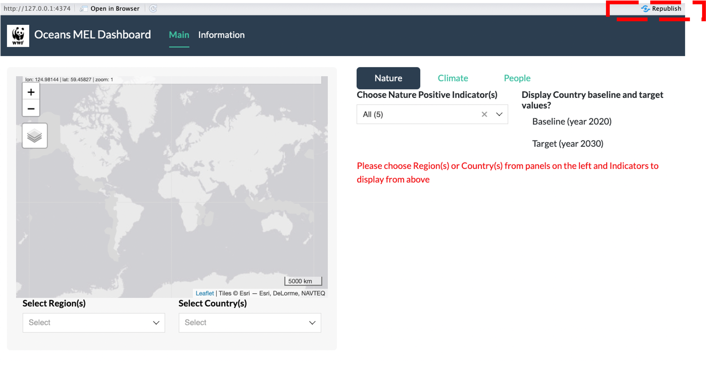

```{r, include = FALSE}
knitr::opts_chunk$set(
  collapse = TRUE,
  comment = "#>"
)
```

The Oceans Dashboard is an interactive application that displays indicator time-series data to monitor progress towards goals for nature, people, and climate. It has been developed as an R package {OceansDash} to facilitate robust documentation and long-term maintenance of the application using the {golem} framework ([read more about {golem} here](https://engineering-shiny.org/build-app-golem.html)).

To install {OceansDash}, first open RStudio and install {devtools} if it is not installed already,

``` r
install.packages('devtools')
```

then install {OceansDash} with,

``` r
devtools::install_github("cabuelow/OceansDash")
```

Once you have {OceansDash} installed, you can run the application locally via:

``` r
library(OceansDash)
run_app()
```

## Table of contents

This manual provides instructions for:

1. editing the dashboard application user-interface and server code base [**here**](#instructions-for-editing-the-application-user-interface-and-server-codebase), and
2. updating indicator data displayed in the dashboard application [**here**](#instructions-for-updating-indicator-data-displayed-in-the-application).

The instructions assume knowledge of how to use [RStudio](https://posit.co/download/rstudio-desktop/) and [Github](https://github.com/).

## Instructions for editing the application user-interface and server codebase

To edit the dashboard application:

1. [Fork and clone](https://happygitwithr.com/fork-and-clone) the [remote github repository](https://github.com/cabuelow/OceansDash) or, if you already have a local {OceansDash} github repository, navigate to the folder on your computer. Then double-click on the .Rproj file `OceansDash.Rproj` to open it in RStudio,
2. Start a new [development branch](https://happygitwithr.com/git-branches.html?q=branch#create-a-new-branch) to make edits in,
3. Make edits to R scripts in {OceansDash} while remembering 'pull, commit and push' regularly to your development branch. [**See below 'Making edits' section**](#making-edits) for more information on what and how to edit,
4. When your edits are complete, make a [pull request](https://happygitwithr.com/pr-extend.html?q=pull%20request#pr-extend) and merge with the remote github repository if there are no conflicts.

### Making edits

#### User-interface and server

There are two main components to the dashboard application, the **user-interface (ui)** and the **server**. 

The **user-interface** is what what we see in the dashboard application. It takes inputs and displays outputs, and has been developed as a series of nested [modules](https://engineering-shiny.org/structuring-project.html?q=modules#using-shiny-modules) to minimise the codebase length. 

The **server** provides instructions for how the dashboard application reacts to inputs to the user-interface and for how it displays outputs. For example, {ggplot} code for visualising data as a user-interface output is located in the **server**, while code defining [widgets](https://shiny.posit.co/r/gallery/widgets/widget-gallery/) for selecting data to visualise in the {ggplot} is located in the **ui** .

To edit the codebase defining the dashboard application user-interface (ui), modules, and server:      

1. Open the **'R/'** folder,
2. edit the user-interface tab panels in `app_ui.R` and server in `app_server.R`,
3. edit the module ui's/servers (aka 'sub-apps') nested within `app_ui.R` in the following scripts: `mod_main.R` and `mod_ind_timeseries.R`

These scripts define specific parts of the dashboard application user-interface:


The data loaded and visualised in the dashboard application is an [RDA file](https://www.r-bloggers.com/2021/12/how-to-read-rda-file-in-r-with-example/#:~:text=RDA%20is%20an%20abbreviation%20for,statistical%20analysis%20and%20create%20graphs.). The RDA file is made in the R script **'data-raw/make-sysdata.R'** and is stored in the **'R/'** folder along with the user-interface, server, and module R scripts.

**Note** that the **make-sysdata.R** file compiles indicator data that has already been processed to regions/countries of interest in to the RDA file. If you want to update the processed data before compiling the indicator data in the RDA file, go to the section below: [Instructions for updating indicator data displayed in the application](#instructions-for-updating-indicator-data-displayed-in-the-application).

To edit or update the data stored in the RDA file and used by the dashboard application:

1. Open the **'data-raw/make-sysdata.R'** script,
2. Here you can import and wrangle processed indicator data to be used internally by the dashboard application. If you add new data, make sure to add it to the 'sysdata.rda' file at the bottom of the script. 
3. Run through all lines of code in the script to update all internal datasets and overwrite the current 'sysdata.rda'.

Once you have made changes to any of the above, you can test your edits by running the development version of the app via:

``` r
golem::run_dev()
```

If you want to deploy or re-deploy the app to a shinyapps.io server, run the development version as above and hit **'Publish' or 'Re-publish'** button on the top right corner of the app as it is running.



*Note that there are many other files in the {OceansDash} package that are not discussed here. Those not mentioned are not necessary for editing or updating the dashboard application, but you can find more information on what they do/how to use them [here](https://engineering-shiny.org/build-app-golem.html)*.

## Instructions for updating indicator data displayed in the application

Scripts for processing indicator data are located in the **'data-raw/process-indicators/'** folder. Instructions for downloading data and processing the indicators are provided below, organised such that indicators derived from the same data source are described together:

1. [Indicators derived from the Ocean Health Index: Marine Red List | Fisheries Stock Condition | Habitat Condition | Carbon storage](#indicators-derived-from-the-ocean-health-index-marine-red-list-fisheries-stock-condition-habitat-condition-carbon-storage)
2. [Indicators using the World Database on Protected Areas and Other Effective Conservation Measures: Effective Protection | Carbon Under Effective Protection](#indicators-using-the-world-database-on-protected-areas-and-other-effective-conservation-measures-effective-protection-carbon-under-effective-protection)
3. [Marine Living Planet Index](#marine-living-planet-index)
4. [Small-scale fisheries rights](#small-scale-fisheries-rights)
5. [Wealth relative Index](#wealth-relative-index)
6. [Human Development Index](#human-development-index)
7. [Climate Adaptation Plans](#climate-adaptation-plans)

#### Indicators derived from the Ocean Health Index: Marine Red List | Fisheries Stock Condition | Habitat Condition | Carbon storage

The *Marine Red List*, *Fisheries Stock Condition*, *Habitat Condition*, and *Carbon Storage* indicators are all sourced from the [Ocean Health Index](https://oceanhealthindex.org/).

Note that data is not available for Alaska.

Citation: Ocean Health Index. 2024. ohi-global version: Global scenarios data for Ocean Health Index, [August 26, 2024]. National Center for Ecological Analysis and Synthesis, University of California, Santa Barbara. Available at: https://github.com/OHI-Science/ohi-global/releases

The *Marine Red List* indicator is the [Ocean Health Index Biodiversity (Species sub-goal) indicator](https://oceanhealthindex.org/global-scores/goal-scores/biodiversity/species/). A high score indicates that most native marine species in a country are not identified as threatened or vulnerable by the IUCN which monitors the status of many species.

The *Fisheries Stock Condition* indicator is the [Ocean Health Index Food Provision (Wild Caught Fisheries subgoal) indicator](https://oceanhealthindex.org/global-scores/goal-scores/food-provision/wild-caught-fisheries/). It measures ability to sustainably maximize wild-caught fisheries.

The *Habitat Condition* indicator is the [Ocean Health Index Biodiversity (Habitat sub-goal) indicator](https://oceanhealthindex.org/goals/biodiversity/habitats/). This goal assesses the condition of marine habitats that are particularly important in supporting large numbers of marine species. The status of each habitat is its current condition relative to its reference condition, which is often based on historical area. A score of 1 indicates that the condition equals or exceeds the reference point. The subgoal score is then calculated by combining the habitat scores for each region.

The *Carbon Storage* indicator is the [Ocean Health Index Carbon storage indicator](https://oceanhealthindex.org/global-scores/goal-scores/carbon-storage/). It captures the ability of coastal habitats to store carbon given the amount of carbon they store and their health.

To update these indicators:

1. download the most recent national indicator scores [here](https://oceanhealthindex.org/global-scores/data-download/),
2. place the downloaded folder in **'data-raw/process-indicators/data-downloaded/ocean-health-index'**,
3. open the R script **'data-raw/process-indicators/scripts/ocean-health-index.R'** and update the pathfile to the downloaded data on line 7,
4. if you are updating other indicators that aren't derived from the Ocean Health Index, do that first before then running the R script **'data-raw/process-indicators/scripts/export-processed-indicators.R'**.

#### Indicators using the World Database on Protected Areas and Other Effective Conservation Measures: Effective Protection | Carbon Under Effective Protection 

Ecosystem extent and carbon storage under effective protection are calculated for mangroves, saltmarsh, and coral reef ecosystems (with the exception of carbon storage for coral reefs as global data is not currently available). Global mapping of seagrass and kelp forest ecosystem extent is not of high enough resolution to estimate their effective protection, but can be included when data becomes available.

**Note that the spatial data files required to process these indicators are too large to be stored on github, and so instructions below for updating and re-processing each indicator require data to be downloaded and stored locally**.

Indicator values are calculated for each country/region using spatial polygon data representing national borders and exclusive economic zones (EEZs). The most recent version of this spatial data can be downloaded [here](https://marineregions.org/downloads.php) - *Marine and land zones: the union of world country boundaries and EEZ's*. As of September 5th, 2024 the current version being used in {OceansDash} is version 3.

This spatial data requires some processing to remove countries that aren't part of the Oceans Dashboard monitoring. To perform this processing:

1.	Download the latest version of the data and save it in the **'data-raw/process-indicators/data-downloaded/'** folder.  
2.	Open **“data-raw/process-indicators/scripts/country_eez_land.R”**. Update the pathfile on Line 8 and run the script. This will save the processed spatial data layer as a geopackage (.gpkg) that is used to process other spatial data layers (see steps for each indicator derived from spatial data below).

Spatial data on protected areas and other effective conservation measures (OECMs) are derived from [World Database on Protected Areas (WDPA)](https://www.protectedplanet.net/en/thematic-areas/wdpa?tab=WDPA) and the [World Database on Other Effective Area-based Conservation Measures (WDOECM)](https://www.protectedplanet.net/en/thematic-areas/oecms?tab=OECMs). The R package [{wdpar}](https://joss.theoj.org/papers/10.21105/joss.04594) is used to download and clean these spatial data layers following best practice (Butchart et al., 2015; Hanson, 2022). This includes: a) excluding protected areas that do not have the status of “Designated”, “Inscribed” and “Established”, and areas that are UNESCO Biosphere Reserves, b) protected areas represented as points with a reported extent are buffered to a circular area using their reported extent, and c) overlapping protected areas are erased such that areas associated with more effective management categories (i.e. higher IUCN Protected Area Management Categories) and historical precedence are kept (Hanson, 2022).

To download and clean the most recent protected area/OECM data using {wdpar}:

1.	Open and run the script “data-raw/process-indicators/scripts/wdpa_data.R”. 

Once you have processed and cleaned the EEZ and protected area/OECM data (described above), you can update the [Effective protection](#effective-protection) and [Carbon under effective protection](#carbon-under-effective-protection) indicators following the steps below.

##### Effective Protection

The percentage of habitat under effective protection was calculated for mangroves, coral reefs, and tidal (salt) marshes. Currently (as of September 2024), there is only a single time point available on extent of coral reefs and tidal marshes. Check for the latest data on the extent of each habitat at the following sources:

1.	Mangroves: [Global Mangrove Watch (1996 - 2020)](https://zenodo.org/communities/globalmangrovewatch/records?q=&l=list&p=1&s=10&sort=newest)
2.	Coral reefs: [Allen Coral Atlas (ACA) - Geomorphic Zonation and Benthic Habitat - v2.0 (2018-2020)](https://developers.google.com/earth-engine/datasets/catalog/ACA_reef_habitat_v2_0)
3.	Tidal Marshes: [Global tidal marshes (2020)](https://zenodo.org/records/8420753)

To update the **Effective protection** indicator for each habitat:

1.	For mangroves and tidal marsh, download the latest version of the data and save it in the folder **“data-raw/process-indicators/data-downloaded/effective-protection/”**.  
2.	For coral, open **“data-raw/process-indicators/scripts/download_coral_extent_from_GEE.R”** to download new data. Replace the path at Line 44 with the new data source and run the script.
3.	Open **“data-raw/process-indicators/scripts/protected_mangrove.R”**. Replace the data path in Line 24 with the path to the new data and run the script. This step can be skipped if no new data is available.
4.	Open **“data-raw/process-indicators/scripts/protected_coral.R”**. Replace the data path in Line 31 with the path to the new data and run the script. This step can be skipped if no new data is available.
5.	Open **“data-raw/process-indicators/scripts/protected_marsh.R”**. Replace the data path in Line 25 with the path to the new data and run the script. This step can be skipped if no new data is available.
6.	Run **“data-raw/process-indicators/scripts/effective_protection_output.R”** to compile data. Run this step whenever the extent data is updated.
7. If you are updating other indicators, do that first before then running an R script that combines all of the processed indicators into a single dataframe that can be used in the dashboard application: **'data-raw/process-indicators/scripts/export-processed-indicators.R'**.

##### Carbon Under Effective Protection

The percentage of carbon under effective protection was calculated for mangrove and tidal marshes. Check for the latest data at the sources listed below:

1.	Above-ground biomass (AGB) in mangroves (2019): [Global Mangrove Distribution, Aboveground Biomass, and Canopy Height](https://daac.ornl.gov/cgi-bin/dsviewer.pl?ds_id=1665)
2.	Soil organic carbon (SOC) in mangroves (2020): [Global mangrove soil carbon data set](https://zenodo.org/records/7729492)
3.	Soil organic carbon (SOC) in tidal marsh (2020): [Global soil organic carbon in tidal marshes version 1](https://zenodo.org/records/10940066)

To update the **Carbon Under Effective Protection** indicator for each habitat:

1.	Download the latest version of the data sets above and save in the folder **“data-raw/process-indicators/data-downloaded/effective-protection/”**.  
2.	For carbon in mangroves, open **“data-raw/process-indicators/scripts/mangrove_carbon.R”**. Replace the data paths in Line 41 and Line 58 with the paths to the new data for AGB and SOC accordingly, and run the script. 
3.	For carbon in tidal marsh, open **“data-raw/process-indicators/saltmarsh_carbon.R”**. Replace the data paths in Line 36 and Line 53 with the paths to the new data for AGB and SOC accordingly, and run the script,
4. if you are updating other indicators, do that first before then running an R script that combines all of the processed indicators into a single dataframe that can be used in the dashboard application: **'data-raw/process-indicators/scripts/export-processed-indicators.R'**.

#### Marine Living Planet Index

The *Marine Living Planet Index* measures trends in marine species populations through time. Index values represent the average rate of change in populations. It is calculated for marine species in each country via the following [*Living Planet Index*](https://www.livingplanetindex.org/) methodology.

Citation: LPI 2024. Living Planet Index database. 2024. < www.livingplanetindex.org/>. Downloaded on 30 August 2024

To update this indicator: 

1. download the most recent data [**here**](https://www.livingplanetindex.org/data_portal),
2. place the downloaded data folder in: **'data-raw/process-indicators/data-downloaded/marine-living-planet-index'**,
3. run the R script **'data-raw/process-indicators/scripts/marine-living-planet-index.R'** to process the indicator for each region/country,
4. if you are updating other indicators, do that first before then running an R script that combines all of the processed indicators into a single dataframe that can be used in the dashboard application: **'data-raw/process-indicators/scripts/export-processed-indicators.R'**.

#### Small-scale fisheries rights

Small-scale fisheries rights represents the degree of application of a legal/regulatory/policy/institutional framework which recognizes and protects access rights for small-scale fisheries. The indicator score refers to the level of implementation: 1 (lowest) to 5 (highest).

Note there is no data available for Alaska, Mozambique, Papua New Guinea, or Madagascar.

Citation: Data from multiple sources compiled by the UN – processed by Our World in Data. “14.b.1 - Degree of application of a legal/regulatory/policy/institutional framework which recognizes and protects access rights for small-scale fisheries (level of implementation: 1 lowest to 5 highest) - ER_REG_SSFRAR” [dataset]. Data from multiple sources compiled by the UN [original data].

To update this indicator: 

1. download the most recent data [**here**](https://ourworldindata.org/sdgs/life-below-water#sdg-indicator-14-b-1-support-small-scale-fishers),
2. place the downloaded .csv file in: **'data-raw/process-indicators/data-downloaded/small-scale-fisheries-rights'**,
3. run the R script **'data-raw/process-indicators/scripts/small-scale-fisheries-rights.R'** to process the indicator for each country,
4. if you are updating other indicators, do that first before then running an R script that combines all of the processed indicators into a single dataframe that can be used in the dashboard application: **'data-raw/process-indicators/scripts/export-processed-indicators.R'**.

#### Wealth relative Index

The Wealth Relative Index was calculated from the inverted of Global Gridded Relative Deprivation Index (GRDI), v1 (2010–2020). Check for the latest data [here](https://sedac.ciesin.columbia.edu/data/set/povmap-grdi-v1).

To update:

1.	Download the latest version of the data and save it in the folder **“data-raw/process-indicators/data-downloaded/”**.  
2.	Open **“data-raw/process-indicators/scripts/wealth_relative_index.R”**. Replace the data path in Line 19 with the path to the new data and run the script.
3. If you are updating other indicators, do that first before then running an R script that combines all of the processed indicators into a single dataframe that can be used in the dashboard application: **'data-raw/process-indicators/scripts/export-processed-indicators.R'**.

#### Human Development Index

The Human Development Index was calculated from the published data: Gridded global datasets for Gross Domestic Product and Human Development Index over 1990–2015. Check for the latest data [here](https://datadryad.org/stash/dataset/doi:10.5061/dryad.dk1j0).

To update:

1.	Download the latest version of the data and save it in the folder **“data-raw/process-indicators/data-downloaded/”**.  
2.	Open **“data-raw/process-indicators/scripts/human_development_index.R”**. Replace the data path in Line 18 with the path to the new data and run the script.
3. If you are updating other indicators, do that first before then running an R script that combines all of the processed indicators into a single dataframe that can be used in the dashboard application: **'data-raw/process-indicators/scripts/export-processed-indicators.R'**.

#### Climate Adaptation Plans

**TODO**
